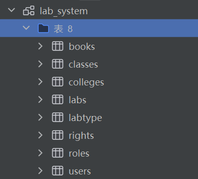

# 实验室管理平台

此项目基于千峰教育的学习项目的基础进行二次开发，主要是用于学习巩固所学知识。项目包含最基本的一些功能同时引入的 ant-map 等新颖的可视化功能。

## 技术架构

前端： Vue3 + Vite5+ Element-plus
后端： SpringBoot + Mybatis + MySql

## 主要功能：

登录：用户可以登录系统。

用户管理：包括用户列表的查看和管理。

权限管理：可以查看角色列表和权限列表，进行权限控制。

实验室管理：包括实验室列表的查看和添加新实验室的功能。

预约管理：包括审核列表、预约列表和预约实验室的功能。

更新地图：可能是指更新实验室位置或布局的地图功能。

## 数据表

## 运行

前端：

安装依赖： npm i install

运行： npm run dev

后端：

后台创建数据库 lab_system, sql 文件所在地址：src/main/resources/lab_system.sql

application.yaml 中修改数据库相关配置。

url username password

## 页面展示

登录页：

首页：

角色列表：

用户列表：

权限列表：

预约：

实验室：

